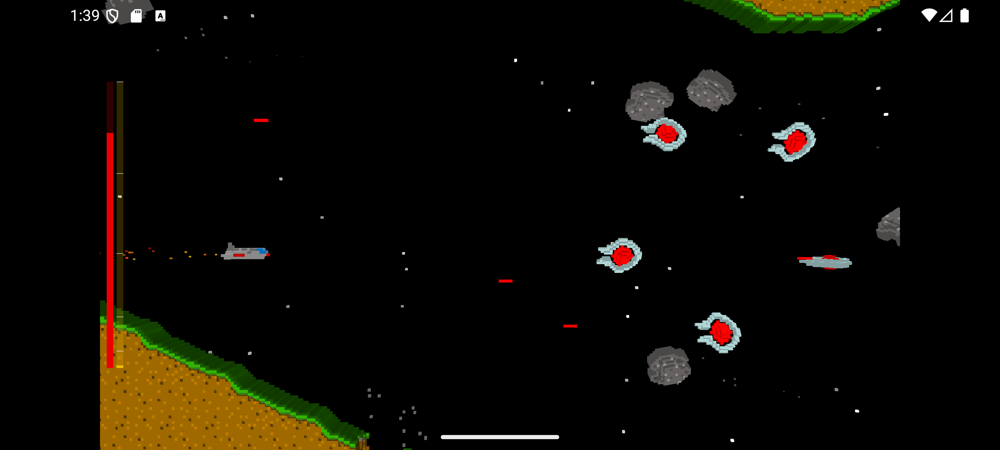
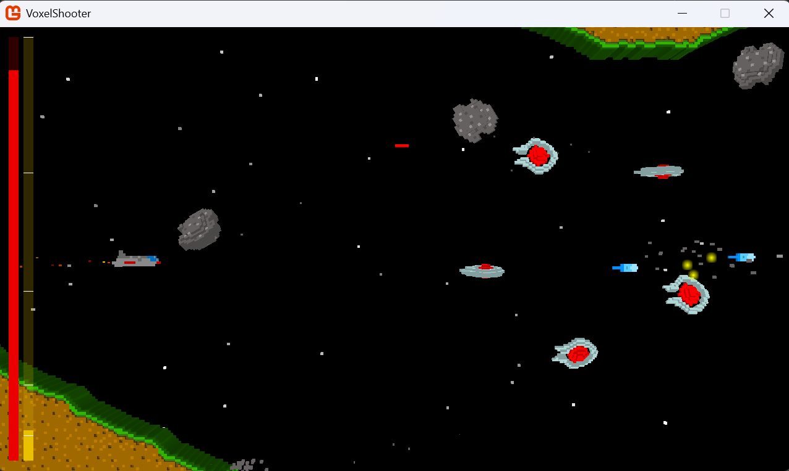

# VoxelShooter

A side-scrolling space shooter where everything, your ship, the enemies, the terrain, is built out of colourful voxels. It started life as an XNA 4.0 project and has since been ported to MonoGame 3.8.5.

Android:


Desktop:


---

## The Game

You're a lone fighter pilot flying through a hostile corridor. The level scrolls forward whether you like it or not, enemies pour in from the right in formations, and your only job is to stay alive long enough to make it through.

It's a short, punchy game, the kind you can get through in a single sitting, but getting there without dying is another matter.

---

## Goal

Survive to the end of the level.

Destroy enemies to collect XP orbs they drop. Pick those up to level your weapons up. Don't get hit too many times. The level auto-scrolls, you can't stop it, so you can't turtle in a corner forever.

---

## How to Play

The level scrolls right automatically. Enemies spawn in waves: sometimes in a circle formation that fans out, sometimes in a straight line that sweeps across. Learn the patterns early, later waves come in fast and expect you to already be out of the way.

Your ship collides with the voxel terrain, so keep an eye on where the walls and floors are. Getting pinned against a surface while taking fire is a quick way to lose.

### Weapons & Levelling Up

XP orbs are dropped by destroyed enemies and drift toward you once you get close enough. Collect them to charge the XP bar on the right of the HUD.

There are five weapon upgrades:

| Level | Weapon |
|-------|--------|
| 0 | Single forward laser |
| 1–2 | Dual alternating lasers, faster fire rate |
| 3–5 | Triple spread shot across a wide arc |
| 4+ | Two extra side-firing beams added to the spread |
| 5 | Rockets fire automatically upward every 2 seconds |

At level 2 an orbiting drone activates around your ship. It spins around you continuously and damages any enemy it touches, useful for anything that tries to get in close.

### The HUD

Two vertical bars on the left side of the screen:

- **Left bar**, health. When it's gone, you're done.
- **Right bar**, XP. The tick marks show each weapon upgrade threshold.

---

## Controls

| Key | Action |
|-----|--------|
| `W` / `↑` | Move up |
| `S` / `↓` | Move down |
| `A` / `←` | Move left |
| `D` / `→` | Move right |
| `Z` | Fire |
| `Escape` | Quit |

---

## Enemies

| Enemy | Description |
|-------|-------------|
| **Asteroid** | Drifts in slowly. Not aggressive, but it will happily fly into you. |
| **Omega** | Actively hostile. Shoots at you and manoeuvres to stay on screen. |
| **Turret** | Stationary but fires rapidly. Take it out before it lines up a clean shot. |
| **Squid** | Weaves around and gets in close. The orbiting drone is your friend here. |

---

## Building & Running

### Prerequisites

- [.NET 9 SDK](https://dotnet.microsoft.com/download)
- [MonoGame 3.8.5](https://www.monogame.net/) (packages restore automatically via NuGet)

---

### Visual Studio Code

The repo includes a `.vscode` folder with build tasks and launch configurations already set up.

**Desktop (OpenGL, Windows, Mac, Linux):**

1. Open the `Run and Debug` panel (`Ctrl+Shift+D`)
2. Select **Desktop Debug** from the dropdown
3. Press `F5`

**Windows (DirectX):**

1. Select **Windows Debug** from the dropdown
2. Press `F5`

**Android:**

1. Connect an Android device (API level 23 or higher) and make sure ADB is set up
2. Select **Android Debug** from the dropdown
3. Press `F5`, this builds, deploys, and attaches the debugger over port 10000

**iOS:**

1. Requires a Mac with Xcode. Build using the **Debug iOS Build** task from `Terminal → Run Task`

To run a build task without launching the debugger, use `Terminal → Run Task` and pick the relevant platform.

---

### Visual Studio

Open `VoxelShooter.sln`. The solution is organised into three folders:

- **Dependencies**, TiledLib (Tiled map runtime) and TiledContentPipeline (content pipeline extension)
- **Desktop**, DesktopGL build
- **Windows**, WindowsDX (Direct3D) build
- **Android** and **iOS** folders in the solution root

**To run:**

1. Right-click the project you want (`Desktop\VoxelShooter`, `Windows\VoxelShooter`, etc.) and set it as the startup project
2. Press `F5` to build and run in debug mode, or `Ctrl+F5` without the debugger

The content pipeline runs automatically as part of the build, no separate MGCB step needed.

---

## Project Structure

```
VoxelShooter/
├── Core/               - All game source code and content
│   └── Content/        - .mgcb file and all game assets (.vxs, .png, .tmx, etc.)
├── Desktop/            - DesktopGL entry point (net9.0)
├── Windows/            - WindowsDX entry point (net9.0-windows)
├── Android/            - Android entry point (net9.0-android)
├── iOS/                - iOS entry point (net9.0-ios)
├── Dependencies/
│   ├── TiledLib/               - Tiled map file runtime library
│   └── TiledContentPipeline/   - MGCB pipeline extension for .tmx files
├── TiledLib/               - TiledLib source
└── TiledContentPipeline/   - TiledContentPipeline source
```

---

## Tech Notes

- Voxel geometry is stored in `.vxs` files (custom format, GZip-compressed) and loaded at runtime
- The level layout comes from a [Tiled](https://www.mapeditor.org/) `.tmx` file (`Core/Content/1.tmx`)
- Enemy spawn positions and wave configurations are defined as object layers inside the same Tiled map
- The content pipeline builds `.tmx` → `.xnb` via the `TiledContentPipeline` extension; `.vxs` files are copied as-is
